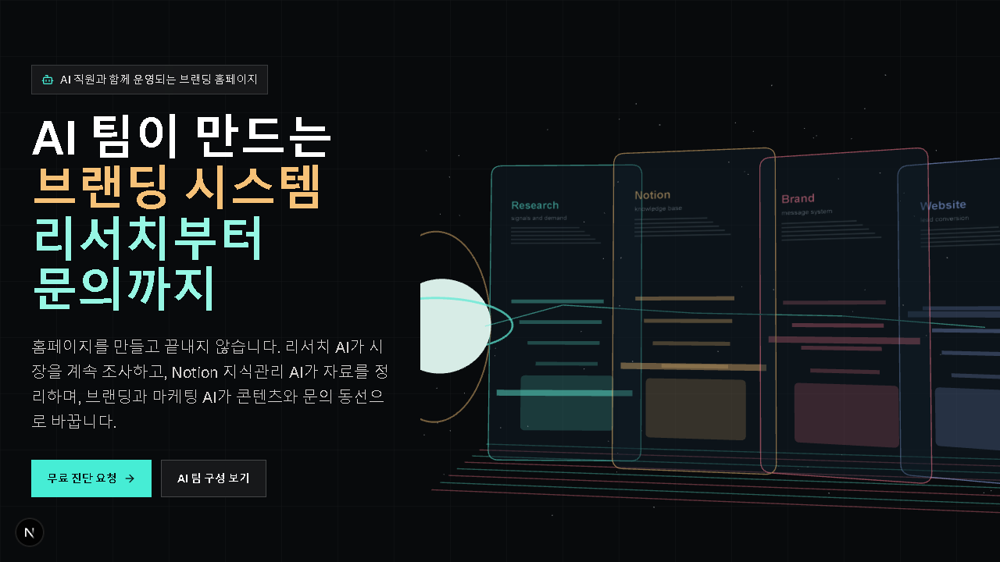

# Brand Ops Homepage

무료 홈페이지 진단으로 시작해 7일 브랜딩 랜딩페이지와 30일 운영 개선으로 이어지는
AI 브랜딩 홈페이지 제작 사업의 공개 홈페이지 MVP입니다.



## What This Project Shows

- Landing page for a homepage/landing-page production service
- Free audit offer for Pilates/PT, beauty, academy/class, and expert businesses
- AI team positioning for research, Notion knowledge management, branding, marketing, and outreach
- 3D and motion used to visualize the operating workflow rather than decoration
- Vercel-ready Next.js App Router setup
- Public repository conventions for contribution, commits, PRs, and CI

## Tech Stack

- Next.js App Router
- React
- TypeScript
- Tailwind CSS
- Three.js
- pnpm
- Vercel

## Getting Started

Requirements:

- Node.js `24.x`
- pnpm `10.x`

```bash
pnpm install
pnpm dev
```

Open [http://localhost:3000](http://localhost:3000).

## Scripts

```bash
pnpm dev           # local development
pnpm build         # production build
pnpm start         # run production server
pnpm lint          # eslint
pnpm typecheck     # TypeScript check
pnpm format        # write Prettier formatting
pnpm format:check  # verify formatting
pnpm check         # format + lint + typecheck + build
```

## Project Docs

- [Homepage Structure](docs/homepage-structure.md)
- [AI Team MVP Design](docs/ai-team-mvp-design.md)
- [Revenue Growth Operating System](docs/revenue-growth-operating-system.md)
- [Daily 10AM Brand Homepage Growth Brief](docs/daily-10am-brand-homepage-growth-brief.md)
- [Outreach and Audit Playbook](docs/outreach-and-audit-playbook.md)
- [Notion Leads CRM Schema](docs/notion-leads-crm-schema.md)
- [Social Content Calendar: Pilates, PT, Beauty](docs/social-content-calendar-pilates-beauty.md)
- [Design System and Motion Guide](docs/design-system-and-motion-guide.md)
- [Landing Brand Insight Card Template](docs/landing-brand-insight-card-template.md)
- [Marketing Experiment Backlog](docs/marketing-experiment-backlog.md)
- [Landing and Branding Effect Research](docs/landing-branding-effect-research.md)
- [User Feedback and Buying Criteria](docs/user-feedback-and-buying-criteria.md)
- [Repository Conventions](docs/repository-conventions.md)
- [Vercel Deployment](docs/vercel-deployment.md)

## Public Use

This repository is intended to be publicly readable and reusable. The code is
licensed under the MIT License. Do not commit private Notion data, customer
information, API keys, or unreleased client work.

## Pre-Launch Notes

Before a public launch, replace placeholder contact details such as
`hello@example.com`, add the production URL to metadata, and confirm whether the
sample audit cards should remain as demo content or be replaced with real case
studies.

## Contributing

See [CONTRIBUTING.md](CONTRIBUTING.md).
