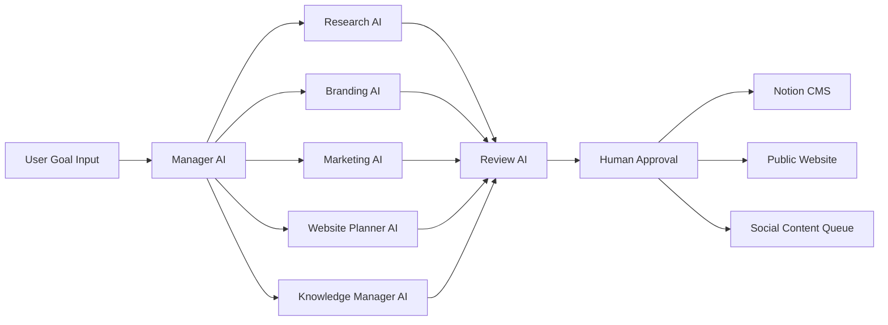
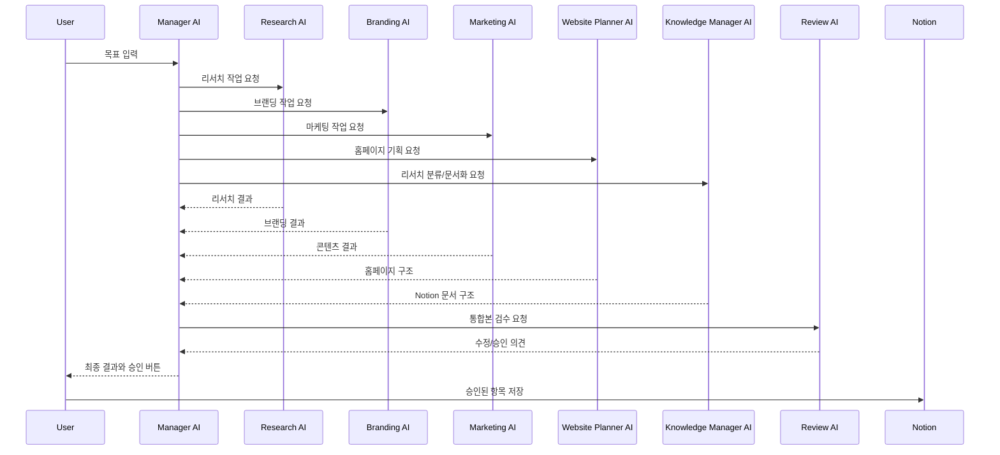

# AI Team Branding Website MVP Design

## 1. Goal

개인 브랜딩 홈페이지 제작 사업을 위해, 먼저 운영자 본인을 브랜딩하는 공개 홈페이지와 내부 AI 팀 대시보드를 만든다.

이 시스템의 핵심 메시지는 다음이다.

> AI 직원들이 리서치, 브랜딩, 마케팅, 홈페이지 기획, 콘텐츠 운영을 나눠 맡고, 사람은 최종 승인과 방향성 결정에 집중한다.

첫 MVP는 고객에게 보여줄 수 있는 시연 가능한 시스템이어야 한다. 완전 자동 게시보다, 결과물 품질과 승인 흐름을 먼저 만든다.

## 2. Product Concept

### Public Side

방문자가 보는 개인 브랜딩 홈페이지.

- 운영자가 어떤 사람인지 보여준다.
- AI 홈페이지 제작 서비스를 설명한다.
- Notion에서 관리한 사례, 글, 서비스 패키지를 자동 반영한다.
- 문의 폼을 통해 리드를 수집한다.

### Internal Side

운영자가 쓰는 AI 팀 대시보드.

- 목표를 입력한다.
- 역할별 AI 직원이 동시에 작업한다.
- 결과를 비교하고 승인한다.
- 승인된 결과를 Notion, 홈페이지, 소셜 콘텐츠 캘린더에 저장한다.

## 3. Core Positioning

### Brand Sentence

AI와 자동화로 개인과 소상공인의 브랜딩 홈페이지를 만들고, 문의와 콘텐츠 운영까지 이어지는 영업 시스템을 구축합니다.

### Customer Promise

단순히 예쁜 홈페이지를 만드는 것이 아니라, 고객이 누구인지, 무엇을 팔아야 하는지, 어떤 콘텐츠로 신뢰를 쌓아야 하는지까지 함께 설계한다.

### Differentiation

- 홈페이지 제작 + 브랜딩 문장 + 콘텐츠 운영 구조를 한 번에 제공
- Notion 기반 CMS로 비개발자도 직접 관리 가능
- AI 직원 워크플로우로 리서치, 카피, 마케팅 콘텐츠를 빠르게 생산
- Instagram, Threads, 블로그 콘텐츠를 한 곳에서 기획하고 승인

## 3.1 Visual Branding Direction

3D와 애니메이션은 사용하는 것이 좋다. 다만 목적은 "AI 느낌을 주는 장식"이 아니라, 이 서비스가 실제로 어떻게 일하는지 보여주는 증거여야 한다.

### Direction

- Hero에는 로봇 캐릭터를 크게 세우기보다, AI 팀이 일하는 3D 워크플로우를 보여준다.
- 핵심 장면은 Research, Notion, Brand, Website 패널이 연결되는 홀로그램 시스템이다.
- 사용자는 첫 화면에서 "AI가 리서치하고, Notion에 정리하고, 홈페이지와 콘텐츠로 바꾸는구나"를 직관적으로 이해해야 한다.
- 톤은 사이버펑크가 아니라 프리미엄 업무 자동화 스튜디오에 가깝게 유지한다.

### Guardrails

- 3D가 CTA나 핵심 문구를 가리면 안 된다.
- 움직임은 느리고 정돈되어야 하며, 사용자의 집중을 방해하지 않아야 한다.
- 모바일에서는 3D를 더 낮은 강도의 배경으로 사용한다.
- 움직임 줄이기 설정을 사용하는 사용자에게는 애니메이션을 최소화한다.
- 실제 사례/전환 증거가 생기면 Portfolio 섹션에서는 3D보다 스크린샷과 전후 비교를 우선한다.

## 4. AI Team Architecture

### Top-Level Flow



### Manager AI

Purpose:

- 사용자 목표를 해석한다.
- 작업을 역할별로 분해한다.
- 각 AI 직원에게 명확한 지시를 전달한다.
- 결과물을 하나의 실행 가능한 패키지로 합친다.

Input:

- 사업 목표
- 타깃 고객
- 원하는 톤
- 판매할 서비스
- 참고 링크 또는 기존 자료

Output:

- 작업 계획
- 역할별 작업 지시
- 최종 통합 결과
- 승인 요청 항목

### Research AI

Purpose:

- 타깃 고객의 문제, 검색 의도, 경쟁 서비스를 조사한다.
- 홈페이지와 콘텐츠에 반영할 인사이트를 만든다.
- 지속적으로 리서치할 주제와 다음 조사 질문을 제안한다.

Output:

- 고객 문제 5개
- 구매 트리거 5개
- 경쟁자 메시지 요약
- 차별화 포인트
- 콘텐츠 주제 후보
- 후속 리서치 큐

### Knowledge Manager AI

Purpose:

- 리서치 AI가 계속 수집하는 자료를 분류한다.
- 중복 자료, 근거 자료, 실행 아이디어, 콘텐츠 소재를 구분한다.
- Notion에 저장할 문서 구조와 태그를 만든다.
- 일회성 답변을 장기 지식 자산으로 바꾼다.

Output:

- Notion 저장 위치 제안
- 문서 제목
- 요약
- 태그
- 관련 프로젝트/콘텐츠 연결
- 원문 링크와 근거
- 다음 액션

### Branding AI

Purpose:

- 운영자의 포지셔닝과 홈페이지 핵심 문장을 만든다.

Output:

- 한 줄 소개
- 상세 자기소개
- 서비스 소개 문장
- 홈페이지 hero 문구 3안
- CTA 문구 5개
- 신뢰 요소 문장

### Marketing AI

Purpose:

- Instagram, Threads, 블로그 콘텐츠를 기획한다.

Output:

- 2주 콘텐츠 캘린더
- Instagram 캡션
- Threads 글타래
- 블로그 제목과 개요
- 카드뉴스 문안
- 해시태그 후보

### Website Planner AI

Purpose:

- 홈페이지 섹션과 사용자 흐름을 설계한다.

Output:

- 페이지 구조
- 섹션별 목적
- 섹션별 문구 초안
- CTA 위치
- 문의 폼 필드
- SEO title/description

### Review AI

Purpose:

- 결과물의 품질을 검수한다.
- 과장, 모호함, 중복, 톤 불일치를 잡는다.

Output:

- 수정 제안
- 위험 문장
- 더 강한 대안 문구
- 승인 가능 여부

## 5. Agent Execution Model

### MVP Execution

초기에는 앱 안에서 한 번의 요청으로 여러 역할을 병렬 실행한다.



### Later Execution

사업화 단계에서는 아래 구조로 확장한다.

- Job Queue: 작업 요청 저장
- Agent Run: 각 AI 직원 실행 기록
- Artifact: 생성된 결과물
- Approval: 사람 승인 기록
- Publisher: Notion, 홈페이지, 소셜 채널 반영

## 6. Notion CMS Design

Notion은 운영자가 쓰는 관리 시스템이자 콘텐츠 원본이다.

### Database: Profile

| Property      | Type     | Purpose            |
| ------------- | -------- | ------------------ |
| Name          | Title    | 이름 또는 브랜드명 |
| Role          | Text     | 포지션             |
| One-liner     | Text     | 한 줄 소개         |
| Bio           | Text     | 상세 소개          |
| Hero Headline | Text     | 첫 화면 제목       |
| Hero Subcopy  | Text     | 첫 화면 설명       |
| CTA Label     | Text     | CTA 버튼 문구      |
| CTA URL       | URL      | 문의 링크          |
| Published     | Checkbox | 홈페이지 반영 여부 |

### Database: Services

| Property     | Type     | Purpose                       |
| ------------ | -------- | ----------------------------- |
| Name         | Title    | 서비스명                      |
| Package      | Select   | Starter, Branding, Automation |
| Price        | Text     | 가격 또는 상담 필요           |
| Summary      | Text     | 짧은 설명                     |
| Deliverables | Text     | 제공 항목                     |
| Best For     | Text     | 추천 고객                     |
| Order        | Number   | 노출 순서                     |
| Published    | Checkbox | 홈페이지 반영 여부            |

### Database: Portfolio

| Property    | Type     | Purpose            |
| ----------- | -------- | ------------------ |
| Name        | Title    | 프로젝트명         |
| Client Type | Select   | 업종               |
| Problem     | Text     | 고객 문제          |
| Solution    | Text     | 해결 방식          |
| Result      | Text     | 결과               |
| Image       | Files    | 대표 이미지        |
| URL         | URL      | 결과물 링크        |
| Published   | Checkbox | 홈페이지 반영 여부 |

### Database: Posts

| Property        | Type         | Purpose                                  |
| --------------- | ------------ | ---------------------------------------- |
| Title           | Title        | 글 제목                                  |
| Channel         | Multi-select | Blog, Instagram, Threads                 |
| Status          | Select       | Idea, Draft, Review, Approved, Published |
| Summary         | Text         | 요약                                     |
| Body            | Text         | 본문                                     |
| SEO Title       | Text         | SEO 제목                                 |
| SEO Description | Text         | SEO 설명                                 |
| Publish Date    | Date         | 발행 예정일                              |
| Published       | Checkbox     | 홈페이지 반영 여부                       |

### Database: Content Calendar

| Property     | Type     | Purpose                                  |
| ------------ | -------- | ---------------------------------------- |
| Name         | Title    | 콘텐츠 이름                              |
| Channel      | Select   | Instagram, Threads, Blog                 |
| Content Type | Select   | Caption, Thread, Carousel, Article       |
| Status       | Select   | Idea, Draft, Review, Approved, Published |
| Hook         | Text     | 첫 문장                                  |
| Body         | Text     | 본문                                     |
| CTA          | Text     | 행동 유도                                |
| Asset Prompt | Text     | 이미지 생성 프롬프트                     |
| Scheduled At | Date     | 게시 예정일                              |
| Source Post  | Relation | Posts 연결                               |

### Database: Leads

| Property      | Type         | Purpose                             |
| ------------- | ------------ | ----------------------------------- |
| Name          | Title        | 문의자명                            |
| Contact       | Text         | 연락처                              |
| Business Type | Text         | 업종                                |
| Budget        | Select       | 예산 범위                           |
| Need          | Multi-select | 홈페이지, 브랜딩, 자동화, 콘텐츠    |
| Message       | Text         | 문의 내용                           |
| Status        | Select       | New, Contacted, Proposal, Won, Lost |
| Created At    | Date         | 문의 시각                           |

### Database: Agent Runs

| Property      | Type   | Purpose                                                 |
| ------------- | ------ | ------------------------------------------------------- |
| Name          | Title  | 실행 이름                                               |
| Goal          | Text   | 사용자 목표                                             |
| Agent         | Select | Manager, Research, Branding, Marketing, Website, Review |
| Status        | Select | Queued, Running, Done, Failed                           |
| Input         | Text   | 입력                                                    |
| Output        | Text   | 출력                                                    |
| Cost Estimate | Number | 추정 비용                                               |
| Created At    | Date   | 실행 시각                                               |

### Database: Research Library

리서치 AI가 계속 수집한 자료를 장기 자산으로 저장한다.

| Property        | Type         | Purpose                                                        |
| --------------- | ------------ | -------------------------------------------------------------- |
| Name            | Title        | 자료 제목                                                      |
| Source URL      | URL          | 원문 링크                                                      |
| Source Type     | Select       | Article, Video, Official Docs, Competitor, Customer Voice      |
| Topic           | Multi-select | AI, Homepage, Branding, Instagram, Threads, Notion, Automation |
| Summary         | Text         | 핵심 요약                                                      |
| Evidence        | Text         | 근거 또는 인용 요약                                            |
| Opportunity     | Text         | 사업에 반영할 기회                                             |
| Related Content | Relation     | Posts 또는 Content Calendar 연결                               |
| Status          | Select       | Inbox, Reviewed, Used, Archived                                |

### Database: Knowledge Notes

Knowledge Manager AI가 리서치 자료를 분류해서 정리한 문서형 지식베이스다.

| Property        | Type     | Purpose                                                      |
| --------------- | -------- | ------------------------------------------------------------ |
| Name            | Title    | 문서 제목                                                    |
| Category        | Select   | Strategy, Customer, Competitor, Channel, Offer, Tech, Policy |
| Summary         | Text     | 5줄 요약                                                     |
| Linked Sources  | Relation | Research Library 연결                                        |
| Action Items    | Text     | 실행할 일                                                    |
| Reusable Prompt | Text     | 재사용 가능한 프롬프트                                       |
| Last Reviewed   | Date     | 마지막 검토일                                                |

## 7. Public Website Structure

### Home Page

1. Hero
   - 핵심 제안
   - 짧은 신뢰 문장
   - CTA 버튼

2. Problem
   - 고객이 홈페이지 제작에서 겪는 문제
   - 예쁜데 문의가 안 오는 문제
   - 콘텐츠 운영이 끊기는 문제

3. Solution
   - 브랜딩 문장
   - 홈페이지 구조
   - Notion CMS
   - 콘텐츠 운영 자동화

4. AI Team Demo
   - 리서치 AI
   - 브랜딩 AI
   - 마케팅 AI
   - 웹기획 AI
   - 검수 AI

5. Services
   - Starter
   - Branding
   - Automation

6. Portfolio / Demo Cases
   - 실제 사례가 없으면 데모 케이스로 시작
   - 단, 데모임을 명확히 표시

7. Insights
   - Notion Posts에서 가져온 글

8. Contact
   - 문의 폼
   - 상담 CTA

## 8. Internal Dashboard Structure

### Screen: AI Team Command Center

Purpose:

- 사용자가 목표를 입력하고 AI 팀을 실행하는 화면.

Main UI:

- Goal input
- Target customer input
- Tone selector
- Output type selector
- Run AI Team button
- Recent runs table

### Screen: Agent Run Detail

Purpose:

- 역할별 결과를 확인하고 수정한다.

Main UI:

- Manager summary
- Research result tab
- Branding result tab
- Marketing result tab
- Website plan tab
- Review result tab
- Approve to Notion button

### Screen: Content Calendar

Purpose:

- 콘텐츠 발행 계획을 확인한다.

Main UI:

- Calendar view
- Channel filter
- Status filter
- Content preview
- Approve / reject buttons

### Screen: Website CMS Preview

Purpose:

- Notion에 저장된 내용이 홈페이지에 어떻게 보이는지 미리 본다.

Main UI:

- Home preview
- Services preview
- Posts preview
- Portfolio preview

## 9. Technical MVP Stack

### Recommended Stack

- Framework: Next.js App Router
- Language: TypeScript
- Styling: Tailwind CSS
- CMS: Notion API
- Database for app state: SQLite or PostgreSQL
- AI Provider: OpenAI API
- Deployment: Vercel

### Why This Stack

- Next.js는 공개 홈페이지와 내부 대시보드를 한 프로젝트에서 만들기 쉽다.
- Notion은 운영자가 직접 콘텐츠를 관리하기 좋다.
- 별도 DB는 AI 실행 기록, 승인 상태, 비용 추적에 필요하다.
- Vercel 배포는 초기 MVP에 빠르다.

## 10. API Boundaries

### Notion

MVP에서 필요한 기능:

- 데이터 소스 조회
- 페이지 생성
- 페이지 업데이트
- 승인된 콘텐츠 저장

### Instagram / Threads

MVP에서는 직접 자동 게시를 1차 범위에서 제외한다.

Reason:

- Meta 앱 승인과 권한 설정이 필요하다.
- 계정 타입과 게시 형식 제약이 있다.
- 초기 사업 검증에는 자동 게시보다 콘텐츠 생산과 승인 흐름이 더 중요하다.

MVP에서는 다음까지만 만든다.

- Instagram 캡션 생성
- Threads 글타래 생성
- 게시용 콘텐츠 캘린더 저장
- 사람이 복사하거나 예약 도구에 옮기는 흐름

V2에서 추가:

- Meta Developer App
- Instagram Professional Account 연결
- Threads API 연결
- OAuth
- 게시 승인 후 publish job 실행

## 11. MVP Build Phases

### Phase 1: Branding Website

Deliverables:

- 공개 홈페이지
- 서비스 섹션
- 문의 폼
- Notion CMS 읽기 구조

Success Criteria:

- 방문자가 10초 안에 무엇을 해주는 사람인지 이해한다.
- 문의 버튼이 명확하다.
- Notion에서 서비스/글을 수정하면 홈페이지에 반영된다.

### Phase 2: AI Team Dashboard

Deliverables:

- 목표 입력 화면
- 역할별 AI 실행
- 결과 탭
- 승인 버튼
- Agent Runs 저장

Success Criteria:

- 한 번의 입력으로 리서치, 브랜딩, 마케팅, 웹기획 결과가 나온다.
- 결과가 Notion에 저장된다.

### Phase 3: Content Operation

Deliverables:

- 2주 콘텐츠 캘린더 생성
- Instagram/Threads용 문안 생성
- 블로그 글 초안 생성
- 승인/반려 상태 관리

Success Criteria:

- 매주 콘텐츠 소재를 새로 고민하지 않아도 된다.
- 홈페이지 글과 소셜 콘텐츠가 같은 메시지에서 파생된다.

### Phase 4: Social Publishing Automation

Deliverables:

- Meta 계정 연결
- 게시 예약
- 게시 결과 저장
- 간단한 성과 리포트

Success Criteria:

- 승인된 콘텐츠가 지정된 채널에 게시된다.
- 게시 URL과 성과 지표가 Notion 또는 내부 DB에 저장된다.

## 12. Initial User Scenario

User input:

> 1인 사업가를 대상으로 AI 홈페이지 제작 서비스를 팔고 싶다. 전문적이지만 어렵지 않은 톤으로 내 브랜딩 홈페이지 문구와 2주치 콘텐츠를 만들어줘.

System output:

- 고객 문제 리서치
- 홈페이지 hero 문구 3안
- 서비스 패키지 3개
- 홈페이지 섹션 구성
- Instagram 콘텐츠 10개
- Threads 글타래 10개
- 블로그 글 제목 5개
- Notion 저장 제안

## 13. Implementation Notes

### Agent Contract

각 AI 직원은 같은 형식으로 결과를 반환해야 한다.

```json
{
  "agent": "marketing",
  "status": "done",
  "summary": "2주 콘텐츠 캘린더 생성 완료",
  "artifacts": [
    {
      "type": "instagram_caption",
      "title": "홈페이지가 문의로 이어지지 않는 이유",
      "body": "..."
    }
  ],
  "risks": [],
  "nextActions": ["검수 후 Content Calendar에 저장"]
}
```

### Human Approval

아래 작업은 반드시 사람 승인 후 실행한다.

- 공개 홈페이지 반영
- Instagram / Threads 게시
- 고객에게 메시지 발송
- 가격 또는 보장성 문구 공개

### Quality Rules

- 과장된 매출 보장 표현 금지
- "무조건", "100%", "자동으로 돈 번다" 같은 문장 금지
- 데모 사례는 실제 사례처럼 표현하지 않기
- 고객 업종별 문구는 구체적으로 쓰기
- CTA는 항상 하나의 행동으로 명확히 쓰기

## 14. Next Development Task

바로 다음 구현 작업은 다음 순서가 좋다.

1. Next.js 프로젝트 생성
2. 공개 홈페이지 첫 화면 구현
3. 서비스/포트폴리오/글 섹션을 정적 데이터로 구현
4. Notion 데이터 구조 연결
5. AI Team Command Center 화면 구현
6. 역할별 AI 실행 API 구현
7. Research Library와 Knowledge Notes 저장 흐름 구현
8. 승인된 결과를 Notion에 저장
