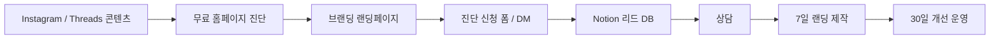

# Daily 10AM Brand Homepage Growth Brief

기준일: 2026-05-28 10:00 KST 운영 기준

이 문서는 랜딩페이지/홈페이지 제작 외주 사업을 수익화하기 위한 매일 오전 10시 운영 브리프다. 목표는 단순히 홈페이지를 만드는 사람이 아니라, **고객의 서비스가 더 잘 팔리도록 브랜딩 문장, 디자인, 랜딩페이지, 문의 동선, SNS 콘텐츠 운영까지 연결하는 사람**으로 포지셔닝하는 것이다.

## 결론

초기 시장은 모든 홈페이지 제작이 아니다. 첫 타겟은 **홈페이지가 매출에 직접 연결되지만 복잡한 기능 개발은 필요 없는 소규모 서비스 사업자**다.

우선순위는 다음과 같이 잡는다.

1. 필라테스, PT, 피부관리, 스튜디오, 공방, 학원 같은 프리미엄 로컬 서비스
2. 강사, 코치, 컨설턴트, 프리랜서, 1인 기업
3. 소규모 병원, 한의원, 심리상담, 재활센터
4. 로컬 생활서비스: 인테리어, 청소, 수리, 사진스튜디오
5. 병원/클리닉 전문 패키지는 수익성이 높지만 의료광고 표현 리스크가 있어 2단계로 진입

피해야 할 초기 타겟은 IT/SaaS 기업, 복잡한 쇼핑몰/예약 시스템, 결제력이 약한 예비창업자, 과장 광고를 원하는 규제 업종이다.

## 포지셔닝

기본 문장:

> 저는 1인/소규모 서비스 사업자가 “왜 나에게 맡겨야 하는지”를 한눈에 설득할 수 있도록, 브랜딩 문장·디자인·문의 동선을 함께 설계하는 전환형 랜딩페이지를 만듭니다.

더 공격적인 문장:

> 예쁜 홈페이지가 아니라, 인스타와 검색에서 들어온 고객이 “여기 맡겨도 되겠다”라고 느끼고 문의하게 만드는 브랜딩 랜딩페이지를 만듭니다.

홈페이지 Hero 후보:

1. 홈페이지, 만들고 끝내지 않습니다.
   당신의 서비스가 더 믿음직하게 보이고, 더 쉽게 문의받도록 브랜딩과 랜딩페이지를 함께 설계합니다.
2. 방문자가 “맡기고 싶다”고 느끼는 홈페이지를 만듭니다.
   디자인만 꾸미는 게 아니라, 타겟·카피·신뢰 구조·문의 흐름까지 같이 설계합니다.
3. 당신의 일을 더 잘 팔리는 브랜드로 보이게 합니다.
   1인 기업, 소규모 병원, 로컬 서비스, 전문가를 위한 매출형 브랜딩 랜딩페이지를 만듭니다.

## 브랜딩 방법론

방법론 이름: **문의전환 브랜딩 OS**

1. 타겟 압축
   누구에게 팔지 먼저 좁힌다. 한 업종, 한 문제, 한 구매 상황을 정한다.

2. 한 문장 포지셔닝
   고객이 나를 어떻게 기억해야 하는지 한 문장으로 만든다.

3. 신뢰 증거 설계
   결과물 예시, 제작 과정, Before/After, 진단 리포트, 업종별 전략, 체크리스트를 배치한다.

4. 랜딩페이지 설득 흐름 설계
   `문제 인식 -> 나의 관점 -> 해결 방식 -> 실제 화면 -> 작업 프로세스 -> 패키지 -> 문의` 순서로 구성한다.

5. 운영형 성장 루프
   제작 후 끝내지 않고 SEO, Instagram, Threads, 고객 반응, 카피 수정, 섹션 개선을 반복한다.

## 타겟별 메시지

| 우선순위 | 타겟                                    | 구매 트리거                            | 팔아야 할 메시지                                             |
| -------- | --------------------------------------- | -------------------------------------- | ------------------------------------------------------------ |
| 1        | 필라테스/PT/피부관리/스튜디오/공방/학원 | 인스타는 있는데 예약 전환이 약함       | 인스타만으로는 신뢰가 부족한 대표님을 위한 예약형 랜딩페이지 |
| 2        | 강사/코치/컨설턴트/프리랜서/1인 기업    | SNS 팔로워는 있지만 신뢰 자산이 부족함 | 내 전문성을 가격이 아니라 신뢰로 팔 수 있게 만듭니다         |
| 3        | 소규모 병원/한의원/심리상담/재활센터    | 오래된 홈페이지, 신환 문의 정체        | 오래된 홈페이지를 상담 전환 중심으로 리뉴얼합니다            |
| 4        | 로컬 생활서비스                         | 견적 문의 비교에서 밀림                | 가격 경쟁이 아니라 신뢰로 견적 문의를 받는 홈페이지          |
| 5        | 병원/클리닉                             | 개원, 리뉴얼, 광고비 증가              | 신환 예약으로 이어지는 정보 정리형 홈페이지                  |

초기 30일은 1순위 타겟 하나만 선택한다. 추천은 `필라테스/PT/피부관리/학원`이다. 이유는 기능 복잡도가 낮고, 예약/상담 전환이 곧 매출이며, Instagram 콘텐츠를 이미 운영하는 경우가 많아 리드 발굴이 쉽기 때문이다.

## 오퍼와 가격 가설

| 상품             |       가격 가설 | 구성                                                           |
| ---------------- | --------------: | -------------------------------------------------------------- |
| 무료 진단        |             0원 | 현재 홈페이지/인스타/네이버플레이스 기준 5개 개선점 제공       |
| 7일 브랜딩 랜딩  |   79만~149만 원 | 1페이지 랜딩, 카피, 반응형 디자인, 문의 CTA, 기본 SEO          |
| 리뉴얼 패키지    |  180만~300만 원 | 기존 홈페이지 구조 재설계, 브랜딩 문장, 섹션 디자인, 전환 동선 |
| 병원/클리닉 전용 |  200만~450만 원 | 진료과/이벤트 중심, 신뢰 요소, 예약 흐름, 표현 리스크 점검     |
| 30일 운영 개선   | 월 39만~79만 원 | 콘텐츠 소재, CTA 개선, 검색/인스타/쓰레드 메시지 실험          |

초기 판매 문구:

> 첫 5팀 한정, 7일 브랜딩 랜딩페이지를 제작합니다. 홈페이지 제작이 아니라 문의 전환을 위한 브랜드 구조를 함께 설계합니다.

## 채널 전략



| 채널      | 역할                  | 운영 방식                                                      |
| --------- | --------------------- | -------------------------------------------------------------- |
| 홈페이지  | 신뢰와 문의 전환 허브 | 대표 문장, 작업 방식, 샘플, 가격대, 무료 진단 CTA              |
| Instagram | 시각적 포트폴리오     | Before/After, 랜딩 구조 분석, 화면 리디자인 릴스/캐러셀        |
| Threads   | 문제 공감과 관계 형성 | 왜 문의가 안 생기는지, 홈페이지 첫 문장 분석 같은 짧은 관점 글 |
| Notion    | 내부 CRM/리서치 DB    | 리드 리스트, 업종별 문제, 경쟁사 분석, 콘텐츠 소재 저장        |
| DM/폼     | 상담 전환             | 무료 10분 홈페이지 진단으로 진입 장벽 낮추기                   |

## AI 직원 운영 구조

매일 오전 10시까지 다음 산출물을 정리한다.

| AI 직원     | 매일 할 일                                       | 산출물                      |
| ----------- | ------------------------------------------------ | --------------------------- |
| 리서치 AI   | 업종별 홈페이지/랜딩/인스타 사례 조사            | Research Library, 리드 후보 |
| 문서정리 AI | 리서치를 ICP, 문제, 메시지, 디자인 패턴으로 분류 | Notion 요약 문서            |
| 마케팅 AI   | 전환 메시지와 실험 우선순위 결정                 | 30일 실험 보드              |
| 디자인 AI   | 잘 팔리는 랜딩 구조와 비주얼 패턴 분석           | 디자인 시스템/섹션 가이드   |
| 영업 AI     | DM, 상담 스크립트, 제안서 문장 작성              | 리드별 접근 메시지          |
| 리뷰 AI     | 과장, 모호함, 규제 리스크, 실행 가능성 검토      | 수정 제안                   |

## 홈페이지에 반영할 구조

1. Hero
   한 문장과 CTA. 오른쪽에는 업종 입력형 브랜드 진단 데모.

2. Target
   “이런 사업에 먼저 맞습니다”를 업종별로 보여준다.

3. Problem
   예쁜 홈페이지보다 문의가 안 생기는 이유를 짧게 보여준다.

4. Method
   문의전환 브랜딩 OS 5단계.

5. AI Operating System
   리서치 AI, 문서정리 AI, 마케팅 AI, 디자인 AI가 연결되는 화면.

6. Before/After
   오래된 소개/흩어진 SNS/약한 CTA가 한 페이지 구조로 정리되는 장면.

7. Packages
   무료 진단, 7일 브랜딩 랜딩, 리뉴얼, 30일 운영 개선.

8. Contact
   “문의하기”가 아니라 “내 업종에 맞는 랜딩 구조 진단받기”.

## 30일 실행 실험

| 기간    | 실험                              | 목표                                    |
| ------- | --------------------------------- | --------------------------------------- |
| 1~3일   | ICP 하나 선택                     | 너무 넓은 메시지 제거                   |
| 1~5일   | 해당 업종 50개 리드 수집          | 홈페이지 없음/오래됨/인스타만 있음 분류 |
| 3~7일   | 무료 진단 신청 문구 3개 테스트    | DM을 만드는 메시지 확인                 |
| 5~10일  | Instagram 캐러셀 5개 제작         | 저장/DM 반응 확인                       |
| 5~10일  | Threads 매일 3개 작성             | 공감 댓글/프로필 방문 유도              |
| 8~14일  | 실제 사업자 10명에게 무료 진단 DM | 상담 2건 확보                           |
| 10~18일 | 특정 업종 샘플 랜딩 1개 제작      | 포트폴리오 증거 만들기                  |
| 15~21일 | 상담 스크립트 정리                | 왜 지금 해야 하는지 설득 강화           |
| 20~25일 | 첫 유료 고객용 창업가 가격 제안   | 1건 결제 목표                           |
| 25~30일 | 결과를 케이스 스터디로 공개       | 다음 고객 설득 자산화                   |

## 오늘 바로 실행할 5가지

1. 홈페이지 CTA를 `무료 홈페이지 진단 받기` 중심으로 정리한다.
2. 홈페이지 첫 화면 문구를 “예쁜 제작”이 아니라 “문의 전환 브랜딩”으로 더 좁힌다.
3. 타겟 섹션은 필라테스/PT/피부관리/학원/1인 전문가 중심으로 재배열한다.
4. Notion에 `Research Library`, `Target Segments`, `Outreach CRM`, `Website Experiments` DB를 만든다.
5. Instagram/Threads 첫 콘텐츠 주제를 `인스타만으로 예약 전환이 막히는 5가지 이유`로 잡는다.

## 매일 10시 체크리스트

- 새로 찾은 리드 후보 수
- 가장 많이 보인 문제 패턴
- 오늘 우선 연락할 업종
- 오늘 게시할 Instagram/Threads 주제
- 홈페이지에 바꿀 문장 1개
- Notion에 저장할 근거 링크
- 다음 리서치 질문

## 01:10 첫 자동 작업 기록

실행 시각: 2026-05-28 01:10 KST

반영한 판단:

- 첫 화면에서 “홈페이지 제작”보다 `인스타와 검색에서 들어온 고객이 믿고 문의하게 만드는 브랜딩 랜딩페이지`를 더 직접적으로 말한다.
- 초기 타겟은 `필라테스/PT/피부관리`, `학원/클래스/공방`, `강사/코치/1인 전문가`, `소규모 병원/상담센터`로 좁힌다.
- 패키지는 무료 진단, 7일 브랜딩 랜딩, 30일 운영 개선으로 단순화한다.
- AI 팀은 장식이 아니라 리서치 AI, 문서정리 AI, 마케팅 AI, 디자인 AI가 계속 개선하는 운영 구조로 설명한다.

홈페이지 반영:

- Hero 보조 문구를 프리미엄 로컬 서비스와 1인 전문가 중심으로 수정.
- `First Customers` 섹션을 추가해 우선 타겟 4개를 바로 보여주도록 변경.
- `What I Do` 섹션을 `문의전환 브랜딩 OS` 메시지로 정리.
- 패키지 가격 가설을 30일 실험 전략과 맞춤.

다음 자동 작업 질문:

- 첫 타겟을 `필라테스/PT/피부관리`로 고정할지, `학원/클래스`로 시작할지 비교한다.
- 각 타겟별 무료 진단 DM 문구를 3개씩 만든다.
- Before/After 섹션에 실제 샘플 화면을 더 구체적으로 넣는다.

## 01:40 두 번째 자동 작업 기록

실행 시각: 2026-05-28 01:40 KST

선택 타겟: `필라테스/PT/피부관리`

리서치 관찰:

- 필라테스/운동 계열 페이지는 체험수업, 회차별 가격, 1:1/듀엣/그룹 구분, 유효기간, 환불 규정, 카카오 상담 예약이 전환 정보로 자주 등장한다.
- 가격대가 낮은 충동구매가 아니라 회당 수만 원에서 수십 회 패키지로 이어지는 구매라서, 처음 보는 고객은 가격표와 후기, 강사 전문성, 체험 예약을 함께 확인하려고 한다.
- 링크형 프로필/이벤트형 페이지는 빠른 예약 버튼에는 강하지만, 브랜드 신뢰와 FAQ, 패키지 비교, 후기 맥락을 충분히 쌓기 어렵다.
- 견적 비교형 서비스는 `간단한 요청 -> 여러 견적 -> 후기/비용 비교 -> 일정 협의`처럼 고객 행동을 단계로 쪼개서 불안을 줄인다. 우리 무료 진단도 이 흐름을 참고해야 한다.

홈페이지 반영:

- `BrandDemo`를 업종별 진단 데모로 개선했다.
- 샘플 업종을 `필라테스`, `피부관리`, `학원`, `1인 전문가`로 바꿨다.
- 각 업종마다 첫 문장, 리드 신호, 다음 액션, 개선 루프가 다르게 보이도록 수정했다.

타겟별 무료 진단 관점:

| 타겟        | 진단 질문                                                   | 랜딩에서 보여줄 정보                        |
| ----------- | ----------------------------------------------------------- | ------------------------------------------- |
| 필라테스/PT | 체험수업, 가격, 후기, 예약 버튼이 한 화면에 있는가          | 체험 CTA, 가격표, 강사 전문성, 후기, FAQ    |
| 피부관리    | 시술/관리 코스와 가격, 주의사항, 예약 방법이 명확한가       | 대표 코스, 전후보다 안전한 후기, 위치, 예약 |
| 학원/클래스 | 커리큘럼, 성과, 레벨테스트, 상담 CTA가 분리되어 있지 않은가 | 과정, 성과, 수강 후기, 상담 신청            |
| 1인 전문가  | 왜 이 사람에게 맡겨야 하는지 증거가 충분한가                | 소개 문장, 전문성, 패키지, 상담 CTA         |

다음 자동 작업 질문:

- 필라테스/PT/피부관리용 DM 문구를 `무료 진단`, `가격표 정리`, `인스타 예약 전환` 3가지 각도로 만든다.
- Before/After 섹션을 지금보다 더 구체적인 `흩어진 인스타 정보 -> 예약형 랜딩 구조`로 바꾼다.
- Contact 섹션의 메일 CTA를 실제 진단 신청 폼 구조로 확장할지 검토한다.

## 02:10 세 번째 자동 작업 기록

실행 시각: 2026-05-28 02:10 KST

선택 타겟: `학원/클래스`

리서치 관찰:

- 학원/클래스 랜딩은 `커리큘럼`, `수업 대상`, `일정`, `강사진`, `후기`, `상담/체험 신청`이 전환 정보로 반복된다.
- 학원 관리 SaaS 랜딩도 기능을 나열하기보다 실제 학원 후기, 상담 유도, 무료 체험 혜택을 앞세운다. 이는 학원 홈페이지 제작에서도 `수업 설명`보다 `상담 전 불안을 줄이는 정보 구조`가 중요하다는 신호다.
- 전문 교육원/성인교육 페이지는 모집 중인 수업일정, 방문 상담 예약, 목적별 커리큘럼을 전면에 둔다.
- 링크트리식 예약 링크는 빠르지만 커리큘럼, 후기, 비교 근거를 충분히 보여주기 어렵다.

홈페이지 반영:

- `Free Diagnosis` 섹션을 추가했다.
- 무료 진단 산출물을 `첫 화면 진단`, `신뢰 정보 진단`, `문의 동선 진단` 3개로 명확히 했다.
- 고객에게 “홈페이지를 팔기 전에 바로 고칠 3가지를 보여준다”는 오퍼로 전환했다.

학원/클래스 무료 진단 질문:

| 진단 영역 | 질문                                                      | 산출물            |
| --------- | --------------------------------------------------------- | ----------------- |
| 첫 화면   | 어떤 학생/학부모를 위한 수업인지 5초 안에 보이는가        | 첫 문장 후보 1개  |
| 신뢰 정보 | 커리큘럼, 강사진, 후기, 성과, 일정이 흩어져 있지 않은가   | 빠진 정보 5개     |
| 문의 동선 | 체험수업, 레벨테스트, 상담 신청 중 하나로 행동이 모이는가 | CTA 구조 제안 1개 |

다음 자동 작업 질문:

- `무료 진단` 섹션 아래에 실제 진단 예시 카드를 넣을지 검토한다.
- 학원/클래스용 DM 문구를 `체험수업`, `커리큘럼 정리`, `학부모 신뢰` 각도로 만든다.
- Contact 섹션을 `업종`, `현재 링크`, `원하는 문의 방식` 3개 입력 폼처럼 보이게 개선한다.

## 02:40 네 번째 자동 작업 기록

실행 시각: 2026-05-28 02:40 KST

선택 타겟: `1인 전문가/강사/코치/컨설턴트`

리서치 관찰:

- 코치/컨설턴트/1인 전문가 랜딩은 상품 기능보다 `전문성`, `본인 목소리`, `증언`, `무료 상담 CTA`, `짧은 신청 폼`이 더 중요하다.
- 인터뷰 기반으로 전문성을 추출해 랜딩페이지, PR, AI assistant, LinkedIn outreach까지 연결하는 해외 서비스가 있다. 이는 우리 서비스의 `AI 직원 + Notion + 홈페이지 + 콘텐츠` 포지셔닝과 잘 맞는다.
- 개인 브랜드 사이트는 `Authority Platform`, `Story-Driven Site`, `Conversion-Focused Funnel`, `Content Hub`처럼 목적별 구조를 선택한다. 초기 판매용으로는 `Conversion-Focused Funnel`이 가장 적합하다.
- 코치/컨설턴트 홈페이지는 Hero, 신뢰 바, 문제 제기, 변화/결과, 3단계 프로세스, 증언, About, 최종 CTA 흐름이 반복된다.
- 전환을 막는 요소는 모호한 포지셔닝, 약한 CTA, 사회적 증거 부족, 느린 로딩, 모바일 UX 부족이다.

홈페이지 반영:

- Contact 섹션을 단순 메일 버튼에서 `무료 진단 신청서` 형태로 변경했다.
- 입력 항목은 `업종`, `현재 링크`, `원하는 문의 방식` 3개로 제한했다.
- 진단 결과물을 `첫 문장 후보 1개`, `빠진 신뢰 정보 5개`, `문의 CTA 구조 1개`로 다시 보여주어 신청 이유를 강화했다.

1인 전문가용 무료 진단 질문:

| 진단 영역 | 질문                                                       | 산출물           |
| --------- | ---------------------------------------------------------- | ---------------- |
| 포지셔닝  | 어떤 사람을 돕고 어떤 결과를 만드는지 한 문장으로 보이는가 | 한 문장 포지셔닝 |
| 신뢰 증거 | 경력, 사례, 후기, 콘텐츠가 상담 전 믿음으로 이어지는가     | 증거 배치 제안   |
| 상담 동선 | 무료 상담, 신청서, DM 중 하나로 행동이 모이는가            | CTA 구조 제안    |

다음 자동 작업 질문:

- 1인 전문가용 `무료 진단 DM` 문구 3안을 문서화한다.
- 홈페이지에 `문의전환 브랜딩 OS` 5단계를 더 명확한 프로세스 섹션으로 확장할지 검토한다.
- 메일 CTA의 `hello@example.com`을 실제 연락처로 바꾸기 전까지는 배포 단계에서 보류 리스크로 남긴다.

## 03:10 다섯 번째 자동 작업 기록

실행 시각: 2026-05-28 03:10 KST

선택 타겟: `소규모 병원/클리닉/상담센터`

리서치 관찰:

- 의료법 제56조는 의료광고에서 치료 경험담 등 치료 효과 오인 우려, 거짓 표시, 비교 광고, 비방, 시술 장면 노출, 중요한 부작용 정보 누락, 객관적 사실 과장, 법적 근거 없는 자격/명칭 표방 등을 제한한다.
- 병원/클리닉은 객단가와 신뢰 니즈가 높지만, 카피 한 줄과 후기 노출 방식이 리스크가 될 수 있어 초반 주력 타겟으로 세게 밀기보다 `정보 정리형 홈페이지`로 접근해야 한다.
- 전문 병원/클리닉 홈페이지 제작 시장은 의료법 준수, 예약/EMR 연동, 환자 후기 노출 제한, 의료광고 사전심의 여부 검토를 차별점으로 말한다.
- 따라서 우리 상품에서 병원/상담 업종은 `매출 보장`, `치료 효과`, `후기 중심 설득`, `전후 비교`가 아니라 `진료 과목`, `의료진/자격의 정확한 표기`, `위치/진료시간`, `예약 동선`, `FAQ`, `심의 필요 표현 분리`로 포지셔닝해야 한다.

홈페이지 반영:

- `Regulated Services` 섹션을 추가했다.
- 병원/상담 업종은 과장보다 안전한 신뢰 구조가 먼저라는 메시지를 넣었다.
- 의료/상담 업종용 원칙을 `효과 보장보다 정보 정리`, `후기와 사례는 신중하게`, `CTA는 상담 흐름 중심`으로 정리했다.
- 타겟 카드의 병원/상담센터 문구도 `치료효과·후기 과장 없이`로 수정했다.

병원/상담센터 무료 진단 질문:

| 진단 영역   | 질문                                                              | 산출물               |
| ----------- | ----------------------------------------------------------------- | -------------------- |
| 정보 구조   | 진료 과목, 의료진, 위치, 진료시간, 예약 방법이 명확한가           | 빠진 정보 체크리스트 |
| 표현 리스크 | 치료효과 보장, 후기, 전후 비교, 비교 우위 표현이 섞여 있지 않은가 | 검토 필요 문구 목록  |
| 예약 동선   | 전화, 카카오, 네이버 예약, 위치 안내가 모바일에서 바로 보이는가   | CTA 구조 제안        |

다음 자동 작업 질문:

- 병원/상담센터는 1차 타겟이 아니라 2차 고가 패키지로 남겨두고, 1차 영업은 필라테스/PT/피부관리와 학원으로 고정할지 판단한다.
- 홈페이지 패키지 영역에 `병원/클리닉은 별도 검토` 문구를 넣을지 검토한다.
- 의료광고 관련 문구는 최종 배포 전 별도 법률/심의 검토가 필요하다는 리스크를 최종 브리프에 남긴다.

## 03:40 여섯 번째 자동 작업 기록

실행 시각: 2026-05-28 03:40 KST

선택 타겟: `뷰티/웰니스/로컬 서비스`

리서치 관찰:

- 뷰티/살롱/웰니스 랜딩 템플릿은 Hero에서 브랜드 로고, 태그라인, 평점, 예약 CTA를 바로 보여주고, 서비스, 가격, 갤러리, 위치로 예약 결정을 돕는다.
- 로컬 서비스 랜딩은 사진/Before-After, 작업 지역, 후기, 견적 신청 폼, 전화 CTA를 반복적으로 사용한다.
- 지역 서비스의 경우 고객은 긴 설명보다 `무엇을 하는지`, `어디서 하는지`, `어떻게 문의/견적 받는지`를 빠르게 확인하려고 한다.
- 견적형 로컬 서비스는 `무료 견적`, 뷰티/웰니스는 `예약/체험`, 교육은 `상담/레벨테스트`처럼 업종마다 CTA 이름이 달라야 한다.

홈페이지 반영:

- `Free Diagnosis` 섹션 아래에 `Diagnosis Samples` 예시 카드를 추가했다.
- 필라테스/PT, 피부관리/뷰티, 학원/클래스별로 진단 신호와 수정 방향을 바로 보여준다.
- 무료 진단이 막연한 영업 문구가 아니라 실제 개선 포인트를 짧게 제공하는 서비스라는 점을 강화했다.

뷰티/웰니스 진단 질문:

| 진단 영역   | 질문                                                       | 산출물               |
| ----------- | ---------------------------------------------------------- | -------------------- |
| 서비스 메뉴 | 대표 코스, 가격대, 소요 시간, 예약 방법이 한 화면에 있는가 | 빠진 정보 체크리스트 |
| 신뢰 증거   | 후기, 사진, 위치, 운영 시간이 예약 판단을 돕는가           | 신뢰 정보 배치 제안  |
| 예약 CTA    | 카카오/네이버/전화 예약 중 하나로 행동이 모이는가          | CTA 문구와 위치 제안 |

다음 자동 작업 질문:

- Before/After 섹션을 업종별로 더 구체적인 카드로 바꾼다.
- 패키지 섹션에 `첫 5팀 한정` 같은 초기 판매 문구를 넣을지 검토한다.
- 무료 진단 신청서 입력값을 실제 폼으로 저장하려면 Notion Leads DB 또는 별도 API가 필요하다.

## 04:10 일곱 번째 자동 작업 기록

실행 시각: 2026-05-28 04:10 KST

선택 주제: `무료 진단 오퍼와 첫 유료 전환`

리서치 관찰:

- 무료 랜딩페이지/웹사이트 감사 도구들은 `명확성`, `CTA`, `신뢰 증거`, `SEO`, `폼`, `접근성`, `모바일 경험`처럼 전환 누수를 찾는 항목을 전면에 둔다.
- 좋은 무료 진단 오퍼는 “전략 상담”처럼 넓게 말하지 않고, 사용자가 바로 받을 수 있는 산출물을 구체적으로 말한다. 예: 우선순위가 있는 수정 목록, 스크린샷 기반 지적, 카피 수정안, CTA 개선안.
- 웹 에이전시의 무료 감사는 잠재고객 발굴 도구로 쓰인다. 낮은 점수/문제 신호가 있는 사업자에게 구체적인 대화 시작점을 만든다.
- 무료 진단 뒤 바로 큰 홈페이지를 팔면 부담이 크다. `작은 범위의 7일 랜딩 제작`으로 이어지는 단계형 오퍼가 더 자연스럽다.

홈페이지 반영:

- 패키지 섹션 위에 `Launch Offer` 카드를 추가했다.
- 초기 5팀은 무료 진단 후 7일 랜딩 제작 범위까지만 제안한다는 문구를 넣었다.
- 포함 항목은 `현재 링크 기준 무료 진단`, `첫 문장·신뢰 정보·CTA 수정안`, `7일 브랜딩 랜딩 제작 범위 제안`, `30일 운영 개선 여부 판단`으로 제한했다.

아웃리치 메시지 초안:

### 필라테스/PT

```text
안녕하세요. 인스타와 예약 흐름을 보다가 연락드렸습니다.

사진과 분위기는 좋은데 처음 보는 고객이 체험수업, 가격, 후기, 예약 방법을 한 번에 확인하기는 조금 어려워 보였습니다.

원하시면 무료로 1페이지 진단을 보내드릴게요. 첫 문장, 빠진 신뢰 정보, 예약 CTA 기준으로 바로 고칠 3가지만 정리해드립니다.
```

### 피부관리/뷰티

```text
안녕하세요. 관리 프로그램과 콘텐츠를 보고 연락드렸습니다.

처음 방문하는 고객 입장에서는 대표 코스, 가격대, 후기, 위치, 예약 방법이 한 화면에 정리되면 예약 결정이 더 쉬울 것 같았습니다.

원하시면 현재 인스타/링크 기준으로 무료 진단을 드리겠습니다. 바로 고칠 첫 화면 문구와 예약 동선 중심으로 봅니다.
```

### 학원/클래스

```text
안녕하세요. 수업 정보를 보다가 연락드렸습니다.

커리큘럼과 후기, 체험수업/상담 신청이 한 페이지에 정리되면 학부모나 수강생이 비교하기 더 쉬울 것 같았습니다.

원하시면 무료로 홈페이지 구조 진단을 보내드리겠습니다. 첫 문장, 빠진 정보, 상담 CTA 3가지만 짧게 정리합니다.
```

다음 자동 작업 질문:

- Contact의 입력 폼은 현재 메일 링크만 여는 UI이므로 실제 저장을 위해 Notion Leads DB 연동 또는 route handler가 필요하다.
- 패키지 섹션에서 `무료 진단 -> 7일 랜딩 -> 30일 개선`의 단계 흐름을 더 시각적으로 연결할 수 있다.
- DM 템플릿을 Notion/문서에 별도 영업 스크립트 파일로 분리할지 검토한다.

## 04:40 여덟 번째 자동 작업 기록

실행 시각: 2026-05-28 04:40 KST

선택 주제: `리드 선별과 아웃리치 플레이북`

리서치 관찰:

- 무료 웹사이트/랜딩 감사 서비스는 `명확성`, `CTA`, `신뢰 증거`, `SEO`, `폼`, `모바일 경험`, `접근성`처럼 전환에 직접 연결되는 항목을 점수화한다.
- 웹 에이전시 prospecting 사례에서는 홈페이지가 전혀 없는 곳보다, 이미 온라인 마케팅을 믿고 있지만 전환 구조가 약한 사업자가 더 좋은 리드로 언급된다.
- Reddit의 웹디자인 영업 논의에서도 일반적인 “웹사이트 필요하세요?”보다, 실제 사이트를 보고 구체적인 비즈니스 문제를 짚는 메시지가 더 낫다는 의견이 반복된다.
- 리드 발굴은 `문제 신호`, `객단가`, `온라인 활동`, `전환 CTA`, `신뢰 자료 존재 여부`를 기준으로 점수화해야 한다.

로컬 문서 반영:

- `docs/outreach-and-audit-playbook.md`를 새로 만들었다.
- 리드 점수표, 우선 연락 대상, 무료 진단 구성, 업종별 DM 템플릿, 진단 회신 형식, 상담 질문, 제안 구조, 주의 표현을 정리했다.

다음 자동 작업 질문:

- 플레이북을 Notion 운영 문서 하위에도 저장할지 검토한다.
- 홈페이지에 영업 플레이북 내용을 더 넣기보다, 다음에는 실제 고객 사례처럼 보이는 샘플 Before/After를 만드는 것이 더 낫다.
- Notion Leads DB 스키마와 연결하면 자동화 루프의 실전성이 커진다.

## 05:10 아홉 번째 자동 작업 기록

실행 시각: 2026-05-28 05:10 KST

선택 주제: `Notion 리드 CRM 구조`

리서치 관찰:

- Notion CRM 템플릿들은 공통적으로 `pipeline stage`, `lead source`, `priority`, `next follow-up date`, `interaction log`, `deal amount`를 관리한다.
- 소규모 사업/프리랜서용 CRM은 복잡한 자동화보다 후속 연락을 놓치지 않는 구조를 강조한다.
- 5단계 파이프라인 예시는 대체로 Qualified, Proposal Sent, Negotiation, Won, Lost처럼 수주 확률을 단계화한다.
- 우리 사업은 일반 CRM보다 `무료 진단`이 핵심 전환 단계이므로 Leads와 Audit Reports를 분리하는 것이 좋다.

로컬 문서 반영:

- `docs/notion-leads-crm-schema.md`를 새로 만들었다.
- Leads, Audit Reports, Outreach Logs, Deals 데이터베이스 구조를 정의했다.
- Follow-up 규칙과 매일 10시 CRM 루틴을 추가했다.

다음 자동 작업 질문:

- Notion에 실제 데이터베이스를 만들려면 현재 도구에서 DB 생성 지원 여부를 확인해야 한다.
- 우선은 Notion 페이지로 스키마를 저장하고, 사용자가 승인하면 실제 Notion DB를 구성한다.
- 다음 사이클에서는 샘플 Before/After를 더 시각적으로 만드는 것이 좋다.

## 05:40 열 번째 자동 작업 기록

실행 시각: 2026-05-28 05:40 KST

선택 주제: `샘플 Before/After와 무료 진단 신뢰 강화`

리서치 관찰:

- 웹사이트 리디자인 사례는 `Before/After`를 보여줄 때 단순히 예뻐진 화면보다 헤드라인 명확성, CTA, 신뢰 요소, 정보 구조, SEO/전환 흐름 개선을 강조한다.
- 랜딩페이지 감사 서비스는 구체적인 수정 예시를 제시할 때 신뢰가 커진다. 예: CTA가 `Submit`이면 더 높은 의도 문구를 제안한다.
- 작은 사업자용 리디자인 사례에서는 `명확한 단일 CTA`, `후기/사진/인증 등 신뢰 요소`, `모바일에서 바로 보이는 문의 흐름`이 반복된다.
- 실제 고객 사례가 없을 때는 가상 샘플을 실제 사례처럼 포장하면 안 된다. `샘플 진단`이라고 명확히 표시해야 신뢰를 해치지 않는다.

홈페이지 반영:

- Before/After 섹션 아래에 `Sample Audits` 카드를 추가했다.
- 필라테스/PT, 피부관리/뷰티, 학원/클래스별로 Before, Fix, After를 구체화했다.
- 섹션 제목에 실제 고객 사례가 아니라 무료 진단 방식 샘플임을 명확히 표시했다.

다음 자동 작업 질문:

- 샘플 진단 카드를 이미지/스크린샷형 모형으로 더 시각화할지 검토한다.
- 실제 첫 고객이 생기면 이 섹션은 `샘플`에서 `케이스 스터디`로 교체한다.
- 다음 사이클에서는 SEO/메타데이터와 LocalBusiness/ProfessionalService 구조화 데이터를 더 타겟에 맞게 정리한다.

## 06:10 열한 번째 자동 작업 기록

실행 시각: 2026-05-28 06:10 KST

선택 주제: `SEO metadata와 구조화 데이터 정리`

리서치 관찰:

- Next.js App Router는 정적 `metadata` 객체를 통해 title, description, Open Graph, Twitter card, robots 같은 메타 태그를 생성한다.
- Google Search Central은 구조화 데이터가 페이지 내용을 분류하는 표준 형식이라고 설명한다.
- Google LocalBusiness 구조화 데이터는 실제 영업시간, 부서, 리뷰, 예약 같은 사업장 정보를 전달하는 용도다.
- Google Organization 구조화 데이터는 조직의 이름, 로고, 주소/전화/온라인 프로필 등 실제 사업자 정보를 명확히 하는 데 적합하다.
- 현재는 실제 사업자 주소, 전화, 도메인, 로고, 소셜 링크가 확정되지 않았으므로 LocalBusiness를 과하게 넣기보다 `Organization`, `WebSite`, `Service` 중심으로 안전하게 정리하는 것이 맞다.

홈페이지 반영:

- `src/app/layout.tsx` metadata title/description을 `무료 진단`, `브랜딩 랜딩페이지`, `필라테스`, `피부관리`, `학원`, `1인 전문가` 키워드 중심으로 수정했다.
- Open Graph와 Twitter card 문구를 현재 오퍼 구조에 맞게 수정했다.
- `src/app/page.tsx` JSON-LD를 단일 `ProfessionalService`에서 `Organization + WebSite + Service + OfferCatalog` 그래프로 변경했다.
- 실제 주소/전화가 없는 상태에서 LocalBusiness 계열 정보를 과하게 넣지 않도록 조정했다.

남은 SEO 리스크:

- 실제 도메인이 정해지면 canonical URL, Open Graph URL, logo/image URL을 추가해야 한다.
- 실제 연락처/사업자 정보가 생기면 Organization의 `url`, `logo`, `contactPoint`, `sameAs`를 보강한다.
- 사업장이 있는 서비스로 운영할 경우 LocalBusiness 구조화 데이터는 주소/전화/영업시간 등 실제 정보가 준비된 뒤 추가한다.

## 06:40 열두 번째 자동 작업 기록

실행 시각: 2026-05-28 06:40 KST

선택 타겟: `필라테스/PT/피부관리`

리서치 관찰:

- 뷰티/살롱 Instagram 전략 자료는 전환 지표로 프로필 방문과 예약 링크 클릭을 중요하게 본다.
- Before/After, 프로세스 영상, 팀/전문가 소개, 후기, 교육 콘텐츠, 시즌/트렌드, 적은 비중의 프로모션이 반복적으로 추천된다.
- 피트니스/필라테스 계열은 수업 분위기, 강사 개성, 회원 증거, 체험 오퍼 콘텐츠가 첫 방문 예약으로 이어지는 구조가 중요하다.
- Stories는 빠른 전환, Reels는 발견, Carousel은 저장/공유와 체크리스트 전달에 적합하다.
- 따라서 우리의 콘텐츠는 예쁜 디자인 홍보가 아니라 `인스타는 있는데 예약이 막히는 이유`를 짚고 무료 홈페이지 진단으로 이어져야 한다.

로컬 문서 반영:

- `docs/social-content-calendar-pilates-beauty.md`를 새로 만들었다.
- 7일 Instagram/Threads 콘텐츠 캘린더, 캐러셀 예시, Threads 예시 10개, 릴스 스크립트, 측정 지표를 정리했다.

다음 자동 작업 질문:

- 소셜 캘린더를 Notion 콘텐츠 캘린더 페이지로 저장할지 검토한다.
- 홈페이지에 콘텐츠 캘린더를 직접 넣기보다는, 현재는 운영 체계 문서로 유지하는 편이 낫다.
- 다음 사이클은 배포 전 리스크 목록 또는 README/GitHub 정리를 확인한다.

## 07:10 열세 번째 자동 작업 기록

실행 시각: 2026-05-28 07:10 KST

선택 주제: `GitHub/Vercel 공개 전 문서 정리`

점검 결과:

- README가 초기 AI 홈페이지 MVP 설명에 머물러 있어 현재 오퍼인 `무료 진단 -> 7일 브랜딩 랜딩 -> 30일 운영 개선`을 반영하지 못하고 있었다.
- 새로 만든 문서들이 README Project Docs에 빠져 있었다.
- Vercel 배포 문서에 현재 로컬 상태, GitHub remote 미연결, Vercel 미링크, placeholder contact 리스크가 명시되어 있지 않았다.
- Repository review checklist에 샘플/규제 업종/placeholder contact 점검 항목이 부족했다.

로컬 문서 반영:

- README의 프로젝트 설명과 문서 목록을 현재 사업 구조에 맞게 업데이트했다.
- Vercel Deployment 문서에 Current Local Status와 배포 보류 조건을 추가했다.
- Repository Conventions 리뷰 체크리스트에 샘플 감사 명시, 규제 업종 표현, placeholder contact 확인을 추가했다.

남은 배포 리스크:

- `hello@example.com`은 실제 연락처로 교체해야 한다.
- production URL이 정해지면 metadata canonical/OG URL을 추가해야 한다.
- GitHub remote가 아직 없다.
- Vercel project link가 아직 없다.
- 실제 고객 사례가 생기기 전까지 샘플 카드는 샘플로 명확히 유지해야 한다.

## 07:40 열네 번째 자동 작업 기록

실행 시각: 2026-05-28 07:40 KST

선택 주제: `로컬 SEO와 검색 등록 체크리스트`

리서치 관찰:

- Google Business Profile 공식 도움말은 사업자가 Search, Maps 등 Google 서비스에 표시되려면 Business Profile을 추가/소유권 주장/검증해야 한다고 설명한다.
- Google Business Profile에서는 주소, 영업시간, 연락처, 사진, 서비스 등 고객이 찾고 연락하는 데 필요한 정보를 관리한다.
- 네이버 서치어드바이저는 사이트의 검색 반영 현황을 모니터링하고 관리할 수 있도록 제공되는 공식 서비스다.
- 네이버 서치어드바이저의 사이트 간단 체크는 사이트 제목, 설명문, 로봇 차단 여부 등 기본 검색 최적화 정보를 확인하는 데 쓰인다.
- 네이버 스마트플레이스는 지역 사업자가 매장 정보, 예약, 주문, 톡톡, 스마트콜 등 고객 접점을 관리하는 데 중요하다.

로컬 문서 반영:

- `docs/local-seo-and-listing-checklist.md`를 새로 만들었다.
- 홈페이지 기본 체크, Google Business Profile, 네이버 서치어드바이저, 네이버 스마트플레이스, 업종별 우선 체크, 진단 리포트 문구를 정리했다.

다음 자동 작업 질문:

- 홈페이지 패키지에 `검색 등록 기본 체크`를 포함 범위로 넣을지 검토한다.
- 실제 도메인과 연락처가 정해지면 Google Search Console, 네이버 서치어드바이저, 스마트플레이스/Google Business Profile 연결이 실행 항목이 된다.
- 상위 노출 보장은 금지하고, 검색 등록/기본 최적화/정보 일관성으로 표현해야 한다.

## 08:10 열다섯 번째 자동 작업 기록

실행 시각: 2026-05-28 08:10 KST

선택 주제: `제안서와 작업 범위 템플릿`

리서치 관찰:

- 랜딩페이지/웹디자인 제안서 템플릿은 공통적으로 project overview, scope of work, timeline, cost, terms and conditions를 포함한다.
- Scope of Work 자료들은 포함 deliverables, 제외 범위, 고객이 제공해야 하는 자료, 수정 횟수, 승인 기준을 명확히 하라고 강조한다.
- 최근 웹디자인 제안 템플릿들은 “Out of Scope” 섹션과 revision limit를 명시하지 않으면 scope creep이 생긴다고 설명한다.
- 프리랜서 계약/제안 사례에서도 수정 횟수, change order, 추가 비용 기준을 처음부터 적는 것이 핵심이다.
- 우리 상품은 7일 제작이므로 `새 페이지 추가`, `예약/결제/회원/관리자`, `무제한 수정`, `법률/의료광고 심의 대행`을 제외 범위로 명확히 해야 한다.

로컬 문서 반영:

- `docs/proposal-and-scope-template.md`를 새로 만들었다.
- 7일 브랜딩 랜딩 제안 구조, 포함 범위, 제외 범위, 7일 일정, 고객 제공 자료, 수정 정책, 가격 가설, 결제 조건, 리스크 문구를 정리했다.

다음 자동 작업 질문:

- 제안서 템플릿을 Notion 페이지로도 저장할지 검토한다.
- Contact 폼이 실제 저장되지 않는 현재 상태에서는 무료 진단 요청이 메일 앱에만 연결된다.
- 다음 사이클에서는 사이트 전체 UX/문구 과밀도를 다시 검토하고 줄일 부분을 찾는다.

## 08:40 열여섯 번째 자동 작업 기록

실행 시각: 2026-05-28 08:40 KST

선택 주제: `배포 전 UX/성능/신뢰 리스크`

리서치 관찰:

- Google Ads Help는 랜딩페이지 결과 개선을 위해 모바일 친화성과 속도를 중요하게 본다.
- Chrome Developers 자료는 모바일 속도가 검색과 광고 랜딩 경험에 영향을 준다고 설명한다.
- web.dev의 LCP 문서는 사용자가 주요 콘텐츠가 로드되었다고 느끼는 시점을 Core Web Vital로 본다.
- web.dev의 site speed/business metrics 자료는 속도와 전환이 연결될 수 있음을 설명한다.
- Baymard 사례는 제품 설명을 간결하게 유지하고 세부 질문은 FAQ/Q&A로 분리하는 방식이 UX에 유리하다는 점을 보여준다.

로컬 문서 반영:

- `docs/prelaunch-ux-risk-register.md`를 새로 만들었다.
- UX, 성능, 샘플 오해, 의료/상담 표현, placeholder contact, Local SEO 보장 오해, 민감 정보, 모바일 텍스트 overflow 리스크를 정리했다.
- 배포 전 필수 체크리스트와 줄이기 후보를 추가했다.

다음 자동 작업 질문:

- 다음 사이클에서는 실제 홈페이지에서 줄일 수 있는 섹션이 있는지 코드 기준으로 검토한다.
- 최종 10시 브리프에는 이 리스크 레지스터의 필수 확인 항목을 포함해야 한다.

## 09:10 열일곱 번째 자동 작업 기록

실행 시각: 2026-05-28 09:10 KST

선택 주제: `필라테스/프리미엄 웰니스 랜딩의 모션, 예약, 로컬 검색 구조`

리서치 관찰:

- 필라테스/웰니스 홈페이지는 아름다운 무드보다 실제 사진, 강사/공간 신뢰, 명확한 수업 설명, 모바일 예약 접근성이 전환에 더 직접적으로 작동한다.
- 최근 필라테스 SEO 글들은 Google Business Profile, 지역 키워드, Reformer/Mat 같은 서비스별 페이지, Instagram Reels와 후기/성공 스토리의 연결을 강조한다.
- 3D/스크롤 모션 사례는 첫인상을 강하게 만들 수 있지만, 좋은 사례일수록 `high-speed`, `mobile-first`, `clear copy`, `CTA`를 함께 유지한다.
- 랜딩페이지 정보량 연구에서는 정보가 많을수록 의사결정과 참여가 떨어질 수 있다는 결과가 있어, 현재 홈페이지는 다음 단계에서 섹션 통합 후보를 계속 점검해야 한다.

홈페이지 반영:

- `HeroScene` WebGL 렌더러에서 스크린샷 보존용 `preserveDrawingBuffer`를 제거하고 `powerPreference`를 명시했다.
- Three.js가 생성하는 실제 `canvas`에 `aria-hidden="true"`와 `role="presentation"`을 부여해 보조기기에는 장식 요소로 처리되게 했다.

문서 반영:

- `docs/prelaunch-ux-risk-register.md`의 UX-02 완화책에 3D canvas 접근성/성능 조치를 추가했다.

검증 결과:

- Prettier, TypeScript, ESLint, `next build --webpack`를 통과했다.
- 로컬 브라우저 검증에서 데스크톱과 390px 모바일 폭 모두 3D canvas가 존재했고, `aria-hidden="true"`, `role="presentation"`, horizontal overflow 없음, console error 0건을 확인했다.

다음 자동 작업 질문:

- 09:45 이후 최종 브리프에서는 섹션을 더 추가하기보다 `무엇을 해주는지`, `누구에게 맞는지`, `무료 진단을 받으면 무엇이 나오는지`가 첫 화면과 첫 스크롤에서 충분히 선명한지 정리한다.
- 실제 문의 전환을 위해 placeholder 이메일, production URL, 예약/문의 폼 연결을 최우선 리스크로 남겨야 한다.

## 09:40 열여덟 번째 자동 작업 기록

실행 시각: 2026-05-28 09:40 KST

선택 주제: `로컬 서비스/1인 전문가 랜딩의 첫 화면 전환 점검`

리서치 관찰:

- 1인 전문가 랜딩은 포트폴리오나 이력서보다 하나의 오퍼, 하나의 CTA, 첫 화면 신뢰 정보가 중요하다.
- 로컬 서비스 랜딩은 멋진 디자인보다 모바일 속도, 첫 화면 CTA, 실제 사진/후기/지역 신뢰 정보, 문의 가능한 경로가 더 직접적인 전환 요소로 반복된다.
- 로컬 리드용 CRO 체크리스트들은 첫 화면에서 `누구에게`, `무엇을`, `어떤 다음 행동으로` 이어지는지가 보여야 한다고 정리한다.
- 감사 체크리스트 기준에서도 헤드라인은 서비스와 대상이 명확해야 하고, CTA는 한 가지 행동으로 반복되는 편이 좋다.

홈페이지 반영:

- Hero H1을 `홈페이지, 만들고 끝내지 않습니다.`에서 `문의로 이어지는 브랜딩 홈페이지를 만듭니다.`로 바꿔 첫 화면 이해도를 높였다.
- Hero 설명문을 필라테스, 피부관리, 학원, 1인 전문가처럼 신뢰와 예약이 중요한 사업 대상으로 더 직접화했다.
- CTA 아래에 `30분 무료 진단`, `첫 문장 후보 1개`, `CTA 구조 제안`을 추가해 무료 진단의 산출물이 첫 화면에서 바로 보이게 했다.
- 줄바꿈된 H1이 보조기기에서 붙어 읽히지 않도록 자연스러운 문장형 `aria-label`을 추가했다.

검증 계획:

- Prettier, TypeScript, ESLint, `next build --webpack`를 통과했다.
- 로컬 브라우저 검증에서 H1 `aria-label`, Hero 무료 진단 산출물 3개, 데스크톱/390px 모바일 horizontal overflow 없음, console error 0건을 확인했다.

다음 자동 작업 질문:

- 09:45 이후 최종 브리프에서는 더 이상 새 섹션을 늘리지 말고, 오늘 당장 실행해야 할 우선순위와 남은 배포 리스크를 정리한다.
- 특히 실제 이메일/문의 폼, production URL, GitHub remote, Vercel link는 수익화 전환의 실질적 차단 요소로 남긴다.

## 10:10 최종 성장 브리프

최종 브리프는 별도 문서로 정리했다.

- [2026-05-28 10:10 KST 최종 성장 브리프](final-10am-brand-homepage-growth-brief.md)

핵심 결론:

- 지금 바로 팔 수 있는 형태는 `첫 5팀 무료 홈페이지 진단`이다.
- 우선 타겟은 `필라테스/PT/피부관리`가 가장 실행 가능성이 높다.
- 오늘 바로 해야 할 일은 실제 문의 경로 확정, 무료 진단 샘플 3개 작성, GitHub/Vercel 공개 준비, Notion Leads CRM 실제 DB 생성이다.
- 배포 전 `hello@example.com`, production URL, GitHub remote, Vercel link, 민감 정보 점검이 남아 있다.

## 참고 링크

- [BrightLocal Local Consumer Review Survey](https://www.brightlocal.com/research/local-consumer-review-survey/)
- [DreamHost Local Business Trust Index](https://www.dreamhost.com/blog/dreamhost-2026-local-business-trust-index/)
- [Kakao 지역 상권 디지털 전환 관련 자료](https://www.kakaocorp.com/page/detail/11523)
- [Newsis 소상공인 온라인 진출 지원 보도](https://www.newsis.com/view/NISX20250306_0003088048)
- [Google LocalBusiness structured data](https://developers.google.com/search/docs/appearance/structured-data/local-business)
- [네이버 스마트플레이스](https://smartplace.naver.com/)
- [TEMKIT 랜딩페이지 제작 비용 가이드](https://temkit.kr/article/?bmode=view&idx=170958444)
- [크몽 랜딩페이지 제작 사례](https://kmong.com/portfolio/view/183229)
- [바디다움 필라테스 레슨 가격/FAQ 예시](https://beautifulbodyacademy.kr/lession/lession-pricing/)
- [미소 필라테스 견적 비교 흐름](https://miso.kr/pilates)
- [Linkfit 업종별 프로필 페이지 예시](https://www.linkmeai.kr/)
- [랠리즈 학원관리 플랫폼 랜딩](https://www.rallyz.co.kr/)
- [클래스업 학원관리 플랫폼 랜딩](https://classup.io/)
- [153캐드캠 전문 학원 페이지](https://153cad.com/)
- [한국조향교육진흥원 수업/상담 페이지](https://www.kptc-edu.com/)
- [Brandbase 코치/컨설턴트 랜딩](https://brandbasehq.com/)
- [Lovepixel 개인 브랜드 웹사이트 구조 분석](https://lovepixelagency.com/personal-brand-website-examples/)
- [Dionis Web LaunchFlow Coach 사례](https://dionisweb.com/portfolio/launchflow-coach)
- [OnLandingPage 디지털 코칭 랜딩 사례](https://onlandingpage.com/)
- [국가법령정보센터 의료법 제56조](https://www.law.go.kr/lsLinkCommonInfo.do?chrClsCd=010202&lsJoLnkSeq=1032849787)
- [의료법 본문 - 국가법령정보센터](https://law.go.kr/LSW/lsInfoP.do?lsiSeq=183558)
- [의료광고 가이드라인 PDF - 국가법령정보센터](https://www.law.go.kr/LSW/lbook/lbFileDownload.do?flExt=pdf&lbookConflSeq=34021&lbookSeq=7901)
- [병원 홈페이지 제작과 의료법 준수 예시](https://yuch.co.kr/services/hospital)
- [Aura Beauty Studio 랜딩 템플릿](https://www.aura.build/templates/beautysalon)
- [BragSlate Before/After 로컬 서비스 페이지](https://bragslate.com/)
- [Embeddable 로컬 서비스 랜딩 템플릿](https://embeddable.co/free-local-service-landing-pages)
- [Henderson Group 살롱 웹사이트 구조](https://hendersongroup.design/salon-website-design)
- [Veylora 무료 랜딩페이지 감사](https://veylora.app/)
- [PageRoast 무료 랜딩페이지 감사](https://getpageroast.com/)
- [Roastd 무료 랜딩페이지 감사](https://www.roastd.io/free-landing-page-audit)
- [Leadpin 소상공인 웹사이트 감사](https://leadpin.app/audit)
- [MetaKream 무료 웹사이트 감사](https://www.metakream.com/free-website-audit/)
- [SimpleRank 소상공인 SEO 감사](https://www.simplerank.ai/)
- [Local SEO Audit Tool](https://localseoaudittool.com/)
- [Notion Small Business CRM Template](https://www.notion.com/templates/small-business-crm)
- [Sasanova CRM Pipeline Template](https://www.sasanova.com/guides/crm-pipeline-template)
- [NoteLinker Free Notion CRM Template](https://www.notelinker.com/tools/notion-crm-template)
- [Grizzly Templates Free Notion CRM](https://www.grizzlytemplates.com/free-notion-crm-template)
- [Google Business Profile Help](https://support.google.com/business/answer/9270657?hl=en)
- [Google Business Profile - Edit your profile](https://support.google.com/business/answer/3039617)
- [Google Search Console](https://search.google.com/search-console)
- [네이버 서치어드바이저 소개](https://help.naver.com/service/30010/contents/17582?lang=ko)
- [네이버 서치어드바이저 사이트 진단](https://searchadvisor.naver.com/diagnose)
- [네이버 스마트플레이스 소개 보도자료](https://www.navercorp.com/media/pressReleasesDetail?seq=31074)
- [네이버 스마트플레이스 톡톡 마케팅 메시지](https://help.naver.com/service/30026/contents/20507?lang=ko)
- [ProposalDesk Landing Page Proposal Template](https://proposaldesk.app/templates/landing-page)
- [Clariva Web Design Scope of Work Template](https://www.clariva.io/templates/web-design-scope-of-work-template)
- [ManyRequests Web Design Project Scope Template](https://www.manyrequests.com/templates/web-design-project-scope-template)
- [Pitchsite Web Design Proposal Template](https://pitchsite.io/templates/web-design-proposal)
- [Brand Vision Web Design Proposal Template](https://www.brandvm.com/post/web-design-proposal-template)
- [SwiftPropose Freelance Web Design Proposal Template](https://www.swiftpropose.com/templates/freelance-web-design-proposal)
- [Google Ads Help - Evaluate landing page performance](https://support.google.com/google-ads/answer/7543502?hl=en)
- [Chrome Developers - Speed is now a landing page factor](https://developer.chrome.com/blog/search-ads-speed)
- [web.dev - Largest Contentful Paint](https://web.dev/articles/lcp)
- [web.dev - Site speed and business metrics](https://web.dev/articles/site-speed-and-business-metrics)
- [Baymard - Product page UX and concise descriptions](https://baymard.com/blog/rei-product-page-ux)
- [ThunderLoud 웹사이트 리디자인 Before/After 사례](https://thunderloud.com/blog/mcallen-website-redesign-before-after)
- [Flow Cre8tive 소규모 비즈니스 웹사이트 변환 사례](https://www.flowcre8tive.com.au/case-studies)
- [CheckLP 랜딩페이지 감사 항목](https://checklp.com/)
- [Masterly Med Spa 웹사이트 리디자인 사례](https://www.themasterly.com/cases/med-spa-website-redesign-that-cut-lead-costs-by-21)
- [Next.js Metadata and OG images](https://nextjs.org/docs/app/getting-started/metadata-and-og-images)
- [Google LocalBusiness structured data](https://developers.google.com/search/docs/appearance/structured-data/local-business)
- [Google Organization structured data](https://developers.google.com/search/docs/appearance/structured-data/organization)
- [Google structured data gallery](https://developers.google.com/search/docs/appearance/structured-data/search-gallery)
- [Adpicto Beauty Salon Instagram Marketing Guide](https://www.adpicto.com/en/blog/beauty-salon-instagram-marketing-guide)
- [Byter Beauty Salon Instagram Strategy](https://www.byter.academy/blog/social-media/beauty-salon-instagram-strategy)
- [Starta Salon Instagram Marketing](https://starta.one/guides/instagram-marketing-salon)
- [Allora Media Instagram Marketing for Salons and Spas](https://www.alloramedia.us/blog/instagram-marketing-salons-spas-beauty)
- [Bookamat Fitness Studio Instagram Guide](https://bookamat.co/blog/grow-studio-with-instagram)
- [LoopWorker Fitness Studio Instagram Strategy](https://www.loopworker.com/blog/fitness-studio-instagram-strategy.html)
- [Reklam5 Pilates SEO/Digital Marketing Guide](https://www.reklam5.com/en/blog/industry-specific-seo/how-should-seo-digital-marketing-and-social-media-be-for-pilates-studios)
- [Colorlib Pilates Studio Website Examples 2026](https://colorlib.com/wp/pilates-studio-website-examples/)
- [Momentum Squads 3D Landing Page Case](https://momentumsquads.com/cases/streamboost-case/)
- [arXiv - How Content Volume on Landing Pages Influences Consumer Behavior](https://arxiv.org/abs/1806.00923)
- [Magnt - Personal Landing Page That Converts 2026](https://magnt.com/blog/personal-landing-page-that-converts)
- [L3ad Solutions - Conversion Web Design for Local Service Businesses](https://l3adsolutions.com/pillars/conversion-web-design)
- [Roast My Page - Landing Page Grading Criteria](https://www.roastmypage.com/grading-criteria)
- [QBall Digital - Local Lead Landing Page CRO Checklist](https://qballdigital.com/cro-landing-page-checklist-for-local-leads-forms-calls-tracking-trust/)
